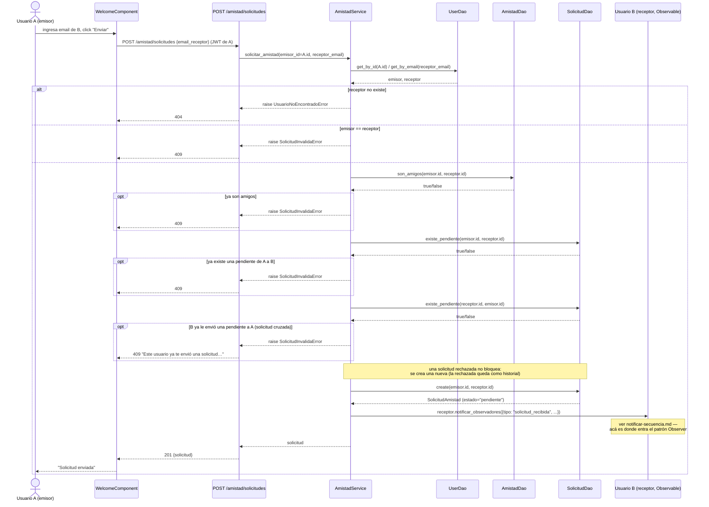

# CU0011 — Solicitar Amistad — Diagrama de secuencia

<!-- implementación anterior, no se regenera: _version_anterior/3. Diseño/4_Diagramas de Secuencia/CU0011 - Solicitar Amistad.png -->

```mermaid
sequenceDiagram
    actor A as Usuario A (emisor)
    participant FE as WelcomeComponent
    participant API as POST /amistad/solicitudes
    participant SVC as AmistadService
    participant UDAO as UserDao
    participant ADAO as AmistadDao
    participant SDAO as SolicitudDao
    participant B as Usuario B (receptor, Observable)

    A->>FE: ingresa email de B, click "Enviar"
    FE->>API: POST /amistad/solicitudes {email_receptor} (JWT de A)
    API->>SVC: solicitar_amistad(emisor_id=A.id, receptor_email)
    SVC->>UDAO: get_by_id(A.id) / get_by_email(receptor_email)
    UDAO-->>SVC: emisor, receptor

    alt receptor no existe
        SVC-->>API: raise UsuarioNoEncontradoError
        API-->>FE: 404
    else emisor == receptor
        SVC-->>API: raise SolicitudInvalidaError
        API-->>FE: 409
    else
        SVC->>ADAO: son_amigos(emisor.id, receptor.id)
        ADAO-->>SVC: true/false
        opt ya son amigos
            SVC-->>API: raise SolicitudInvalidaError
            API-->>FE: 409
        end
        SVC->>SDAO: existe_pendiente(emisor.id, receptor.id)
        SDAO-->>SVC: true/false
        opt ya existe una pendiente de A a B
            SVC-->>API: raise SolicitudInvalidaError
            API-->>FE: 409
        end
        SVC->>SDAO: existe_pendiente(receptor.id, emisor.id)
        SDAO-->>SVC: true/false
        opt B ya le envió una pendiente a A (solicitud cruzada)
            SVC-->>API: raise SolicitudInvalidaError
            API-->>FE: 409 "Este usuario ya te envió una solicitud…"
        end
        Note over SVC,SDAO: una solicitud rechazada no bloquea:<br/>se crea una nueva (la rechazada queda como historial)
        SVC->>SDAO: create(emisor.id, receptor.id)
        SDAO-->>SVC: SolicitudAmistad (estado="pendiente")
        SVC->>B: receptor.notificar_observadores({tipo: "solicitud_recibida", ...})
        Note over B: ver notificar-secuencia.md —<br/>acá es donde entra el patrón Observer
        SVC-->>API: solicitud
        API-->>FE: 201 {solicitud}
        FE-->>A: "Solicitud enviada"
    end
```
